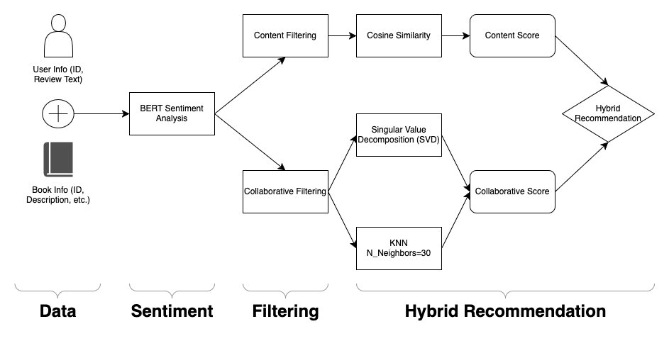

# Book Recommendation AI 2.0 - Amazon Reviews

An Amazon reviews book recommendation system, using BERT-Mini sentiment analysis, KNN/SVD collaborative filtering methods, and TF-IDF Vectorization content filtering, yielding a hybrid recommendation system. 

:warning: ***THIS PAGE IS STILL UNDER CONSTRUCTION AND THE PROJECT WORK IS STILL ONGOING*** :warning:

___

### Brief Information

___

### On The Book Recommendation AI 1.0

___

### Project Pipeline

___

[Back to Top](#goodreads-book-recommendation-ai)

This page was last edited on 08.28.2025